- [Repository Information](#org2f7e157)
  - [Description](#org339af63)
- [Images](#org76d52a5)
- [Usage Instructions](#org308f564)
  - [Arduino Serial Monitor](#org68eb967)
  - [Matlab](#orgd20bc57)
- [Build Instructions](#org5222f39)
- [Software](#org60fb3ee)
- [Firmware](#org02db72e)
  - [BacklightController](#orgd1cf44e)
    - [Library Information](#orgec18fad)
    - [API NAMES](#org40690b5)
    - [API GENERAL](#orga4ae23e)
    - [Ancestors](#orgb32d20d)
    - [Clients](#orgc7e160a)
    - [Devices](#orga7deff0)
    - [More Detailed Modular Device Information](#org3983b95)
    - [Installation Instructions](#org5f92f10)
  - [DigitalController](#orge27be76)
    - [Library Information](#org9c852fc)
    - [API NAMES](#org0f5d80c)
    - [API GENERAL](#orgfd77666)
    - [Ancestors](#org0b3da75)
    - [Clients](#org9873f28)
    - [Devices](#org3a4df39)
    - [More Detailed Modular Device Information](#orgc20d892)
    - [Installation Instructions](#org4d34be0)
  - [SleepAssayController](#org546f517)
    - [Library Information](#org64e4064)
    - [API NAMES](#org404cb45)
    - [API GENERAL](#orga34ad56)
    - [Ancestors](#org96014af)
    - [Clients](#org5720838)
    - [Devices](#orgfd4e99c)
    - [More Detailed Modular Device Information](#org7618f32)
    - [Installation Instructions](#orgbb2b2c0)
- [Hardware](#org0a6595a)
  - [backlight\_controller\_3x2](#org6ddb306)
    - [Repository Information](#org7335029)
    - [Images](#org098fa41)
    - [Schematic](#org32ef2cf)
    - [Gerbers](#orgdfb6be5)
    - [Bill of Materials](#orgfcb574f)
    - [Supplemental Documentation](#org749812e)
  - [sleep\_assay\_wiring](#org3d3be24)
    - [Repository Information](#orgce9b814)
    - [Images](#org5a82714)
    - [Schematic](#orge1c903e)
    - [Gerbers](#org5e6b8ce)
    - [Bill of Materials](#org250630e)
    - [Supplemental Documentation](#org82b1103)


<a id="org2f7e157"></a>

# Repository Information

-   **Name:** sleep\_assay\_controller
-   **Version:** 2.0
-   **License:** BSD, Open-Source Hardware
-   **URL:** <https://github.com/janelia-modular-devices/sleep_assay_controller>
-   **Author:** Peter Polidoro
-   **Email:** peterpolidoro@gmail.com


<a id="org339af63"></a>

## Description

This device controls the IR and visible backlights in the sleep assay rig along with the backlight cooling fans, white lights, buzzers and indicator lights.


<a id="org76d52a5"></a>

# Images


<a id="org308f564"></a>

# Usage Instructions


<a id="org68eb967"></a>

## Arduino Serial Monitor

```sh
# Open terminal, set baud rate to 115200 and set to append newline to
# each request sent to the device.
?
# {
#   "id": "?",
#   "result": {
#     "device_id": {
#       "name": "sleep_assay_controller",
#       "form_factor": "3x2",
#       "serial_number": 0
#     },
#     "api": {
#       "firmware": [
#         "SleepAssayController"
#       ],
#       "verbosity": "NAMES",
#       "functions": [
#         "setIrBacklightAndFanOnAtPower",
#         "setIrBacklightAndFanOnAtIntensity",
#         "setVisibleBacklightAndIndicatorOnAtPower",
#         "setVisibleBacklightAndIndicatorOnAtIntensity",
#         "setWhiteLightAndIndicatorOnAtPower",
#         "setBuzzerAndIndicatorOnAtPower",
#         "getAssayStart",
#         "getAssayEnd",
#         "getAssayDuration",
#         "getExperimentStart",
#         "getExperimentEnd",
#         "getExperimentDuration",
#         "getEntrainmentStart",
#         "getExperimentInfo",
#         "getExperimentDayInfo",
#         "addExperimentDay",
#         "addExperimentDays",
#         "addExperimentDayCopy",
#         "addExperimentDayCopies",
#         "removeLastExperimentDay",
#         "removeAllExperimentDays",
#         "setExperimentDayVisibleBacklight",
#         "setExperimentDayWhiteLight",
#         "setExperimentDayBuzzer",
#         "getAssayStatus"
#       ],
#       "parameters": [
#         "experiment_day",
#         "visible_backlight_delay",
#         "visible_backlight_duration",
#         "buzzer_delay",
#         "buzzer_duration",
#         "day_count"
#       ],
#       "properties": [
#         "visibleBacklightFrequency",
#         "visibleBacklightDutyCycle",
#         "whiteLightEntrainmentPower",
#         "whiteLightRecoveryPower",
#         "whiteLightStartTime",
#         "whiteLightOnDuration",
#         "buzzerOnDurationMin",
#         "buzzerOnDurationMax",
#         "buzzerWaitMin",
#         "buzzerWaitMax",
#         "cameraTriggerFrequency",
#         "entrainmentDuration",
#         "recoveryDuration",
#         "testingDayDuration"
#       ],
#       "callbacks": [
#         "setIrBacklightAndFanOn",
#         "setIrBacklightAndFanOff",
#         "toggleIrBacklightAndFan",
#         "setVisibleBacklightAndIndicatorOn",
#         "setVisibleBacklightAndIndicatorOff",
#         "toggleVisibleBacklightAndIndicator",
#         "setWhiteLightAndIndicatorOn",
#         "setWhiteLightAndIndicatorOff",
#         "toggleWhiteLightAndIndicator",
#         "setBuzzerAndIndicatorOn",
#         "setBuzzerAndIndicatorOff",
#         "toggleBuzzerAndIndicator",
#         "toggleAll",
#         "startCameraTrigger",
#         "stopCameraTrigger",
#         "runAssay",
#         "testAssay",
#         "stopAssay"
#       ]
#     }
#   }
# }
#
# First, set all properties to defaults.
#
setPropertiesToDefaults [ALL]
# {
#   "id": "setPropertiesToDefaults",
#   "result": null
# }
#
# Then get epoch time on the client computer using one of any number of
# ways.
#
# Web Page:
#
# [[https://www.epochconverter.com/]]
#
# Bash: ndate +%s
#
# Example: epoch_time = 1543617175
#
# Set the time on the device:
#
setTime 1543617175
# {
#   "id": "setTime",
#   "result": null
# }
#
# Check the date and time make sure this matches the local date and
# time.
#
now
# {
#   "id": "now",
#   "result": {
#     "year": 2018,
#     "month": 11,
#     "day": 30,
#     "hour": 18,
#     "minute": 32,
#     "second": 56
#   }
# }
#
# If it is off by a few hours, the time zone may need to be adjusted.
# For example, for daylight savings.
#
timeZoneOffset setValue -5
# {
#   "id": "timeZoneOffset",
#   "result": -5
# }
# Set IR backlight calibration
irBacklightPowerToIntensityRatio setValue [5.35]
# {
#   "id": "irBacklightPowerToIntensityRatio",
#   "result": [
#     5.350000
#   ]
# }
# Set visible backlight calibration
visibleBacklightPowerToIntensityRatio setValue [14.62]
# {
#   "id": "visibleBacklightPowerToIntensityRatio",
#   "result": [
#     14.620000
#   ]
# }
irBacklightIntensityMax setValue [12]
# {
#   "id": "irBacklightIntensityMax",
#   "result": [
#     12.000000
#   ]
# }
getPropertyValues [SleepAssayController]
# {
#   "id": "getPropertyValues",
#   "result": {
#     "visibleBacklightFrequency": 10.000000,
#     "visibleBacklightDutyCycle": 50,
#     "whiteLightEntrainmentPower": 50,
#     "whiteLightRecoveryPower": 50,
#     "whiteLightStartTime": 9,
#     "whiteLightOnDuration": 12,
#     "buzzerOnDurationMin": 1,
#     "buzzerOnDurationMax": 4,
#     "buzzerWaitMin": 1,
#     "buzzerWaitMax": 3,
#     "cameraTriggerFrequency": 0.500000,
#     "entrainmentDuration": 2,
#     "recoveryDuration": 2,
#     "testingDayDuration": 24
#   }
# }
getAssayDuration
# {
#   "id":"getAssayDuration",
#   "result":4
# }
entrainmentDuration setValue 1
# {
#   "id":"entrainmentDuration",
#   "result":1
# }
recoveryDuration setValue 1
# {
#   "id":"recoveryDuration",
#   "result":1
# }
getAssayDuration
# {
#   "id":"getAssayDuration",
#   "result":2
# }
getExperimentInfo
# {
#   "id":"getExperimentInfo",
#   "result":[]
# }
addExperimentDay
# {
#   "id":"addExperimentDay",
#   "result":0
# }
getExperimentInfo
# {
#   "id": "getExperimentInfo",
#   "result": [
#     {
#       "visible_backlight_intensity": 0.000000,
#       "visible_backlight_delay": 0.000000,
#       "visible_backlight_duration": 0.000000,
#       "white_light_power": 0.000000,
#       "buzzer_power": 0.000000,
#       "buzzer_delay": 0.000000,
#       "buzzer_duration": 0.000000
#     }
#   ]
# }
setExperimentDayVisibleBacklight 0 5.0 0 12
# {
#   "id": "setExperimentDayVisibleBacklight",
#   "result": {
#     "visible_backlight_intensity": 5.000000,
#     "visible_backlight_delay": 0.000000,
#     "visible_backlight_duration": 12.000000,
#     "white_light_power": 75.000000,
#     "buzzer_power": 0.000000,
#     "buzzer_delay": 0.000000,
#     "buzzer_duration": 0.000000
#   }
# }
setExperimentDayWhiteLight 0 75
# {
#   "id": "setExperimentDayWhiteLight",
#   "result": {
#     "visible_backlight_intensity": 0.000000,
#     "visible_backlight_delay": 0.000000,
#     "visible_backlight_duration": 0.000000,
#     "white_light_power": 75.000000,
#     "buzzer_power": 0.000000,
#     "buzzer_delay": 0.000000,
#     "buzzer_duration": 0.000000
#   }
# }
addExperimentDayCopy 0
# {
#   "id":"addExperimentDayCopy",
#   "result":1
# }
setExperimentDayBuzzer 1 50 3 12
# {
#   "id": "setExperimentDayBuzzer",
#   "result": {
#     "visible_backlight_intensity": 5.000000,
#     "visible_backlight_delay": 0.000000,
#     "visible_backlight_duration": 12.000000,
#     "white_light_power": 75.000000,
#     "buzzer_power": 50.000000,
#     "buzzer_delay": 3.000000,
#     "buzzer_duration": 12.000000
#   }
# }
getExperimentInfo
# {
#   "id": "getExperimentInfo",
#   "result": [
#     {
#       "visible_backlight_intensity": 5.000000,
#       "visible_backlight_delay": 0.000000,
#       "visible_backlight_duration": 12.000000,
#       "white_light_power": 75.000000,
#       "buzzer_power": 0.000000,
#       "buzzer_delay": 0.000000,
#       "buzzer_duration": 0.000000
#     },
#     {
#       "visible_backlight_intensity": 5.000000,
#       "visible_backlight_delay": 0.000000,
#       "visible_backlight_duration": 12.000000,
#       "white_light_power": 75.000000,
#       "buzzer_power": 50.000000,
#       "buzzer_delay": 3.000000,
#       "buzzer_duration": 12.000000
#     }
#   ]
# }
getExperimentDuration
# {
#   "id": "getExperimentDuration",
#   "result": 2
# }
getAssayDuration
# {
#   "id": "getAssayDuration",
#   "result": 4
# }
testAssay
# {
#   "id": "testAssay",
#   "result": null
# }
getAssayStatus
# {
#   "id": "getAssayStatus",
#   "result": {
#     "time_now": 1543617266,
#     "date_time_now": {
#       "year": 2018,
#       "month": 11,
#       "day": 30,
#       "hour": 18,
#       "minute": 34,
#       "second": 26
#     },
#     "assay_day": 0.666667,
#     "phase": "ENTRAINMENT",
#     "phase_day": 0.666667,
#     "visible_backlight_intensity": 0.000000,
#     "white_light_power": 50.000000,
#     "buzzer_power": 0.000000,
#     "buzzing": false,
#     "testing": true
#   }
# }
stopAssay
# {
#   "id": "stopAssay",
#   "result": null
# }
runAssay
# {
#   "id": "runAssay",
#   "result": null
# }
getAssayEnd
# {
#   "id": "getAssayEnd",
#   "result": {
#     "year": 2018,
#     "month": 12,
#     "day": 4,
#     "hour": 9,
#     "minute": 0,
#     "second": 0
#   }
# }
stopAssay
# {
#   "id": "stopAssay",
#   "result": null
# }
removeAllExperimentDays
# {
#   "id": "removeAllExperimentDays",
#   "result": null
# }
setIrBacklightAndFanOff
# {
#   "id": "setIrBacklightAndFanOff",
#   "result": null
# }
```


<a id="orgd20bc57"></a>

## Matlab

```matlab
getAvailableComPorts()
serial_port = 'COM9'; % example
dev = ModularClient(serial_port);
dev.open();
dev.setPropertiesToDefaults({'ALL'});
% look up time zone offset for your location
% taking into account daylight savings time
% if necessary
% e.g.
% U.S. Eastern = -5
% U.S. Eastern daylight savings = -4
time_zone_offset = -4;
dev.timeZoneOffset('setValue',time_zone_offset);
dev.setTime(etime(clock,[1970,1,1,0,0,0]));
n = dev.now();
t = clock;
dev.adjustTime((t(4) - n.hour)*60*60);
dev.now()
%   year: 2018
%  month: 11
%    day: 30
%   hour: 17
% minute: 44
% second: 59
% check to make sure this matches the local date and time
% Set IR backlight calibration
dev.irBacklightPowerToIntensityRatio('setValue',{5.35});
% Set visible backlight calibration
dev.visibleBacklightPowerToIntensityRatio('setValue',{14.62});
dev.irBacklightIntensityMax('setValue',{12});
dev.getPropertyValues({'SleepAssayController'})
%  visibleBacklightFrequency: 10.0
%  visibleBacklightDutyCycle: 50
% whiteLightEntrainmentPower: 50
%    whiteLightRecoveryPower: 50
%        whiteLightStartTime: 9
%       whiteLightOnDuration: 12
%        buzzerOnDurationMin: 1
%        buzzerOnDurationMax: 4
%              buzzerWaitMin: 1
%              buzzerWaitMax: 3
%     cameraTriggerFrequency: 0.5
%        entrainmentDuration: 2
%           recoveryDuration: 2
%         testingDayDuration: 24
dev.getAssayDuration()
% 4
dev.entrainmentDuration('setValue',1);
dev.recoveryDuration('setValue',1);
dev.getAssayDuration()
% 2
dev.getExperimentInfo()
% Empty cell array: 0-by-1
dev.addExperimentDay()
% 0
info = dev.getExperimentInfo();
info{1}
% visible_backlight_intensity: 0.0
%     visible_backlight_delay: 0.0
%  visible_backlight_duration: 0.0
%           white_light_power: 0.0
%                buzzer_power: 0.0
%                buzzer_delay: 0.0
%             buzzer_duration: 0.0
experiment_day = 0;
visible_backlight_intensity = 5.0;
visible_backlight_delay = 0;
visible_backlight_duration = 12;
dev.setExperimentDayVisibleBacklight(experiment_day, ...
                                     visible_backlight_intensity, ...
                                     visible_backlight_delay, ...
                                     visible_backlight_duration);
white_light_power = 75;
dev.setExperimentDayWhiteLight(experiment_day,white_light_power);
dev.addExperimentDayCopy(0)
% 1
experiment_day = 1;
buzzer_power = 50;
buzzer_delay = 3;
buzzer_duration = 12;
dev.setExperimentDayBuzzer(experiment_day, ...
                           buzzer_power, ...
                           buzzer_delay, ...
                           buzzer_duration);
info = dev.getExperimentInfo();
info{2}
% visible_backlight_intensity: 5.0
%     visible_backlight_delay: 0.0
%  visible_backlight_duration: 12.0
%           white_light_power: 75.0
%                buzzer_power: 50.0
%                buzzer_delay: 3.0
%             buzzer_duration: 12.0
dev.getExperimentDuration()
% 2
dev.getAssayDuration()
% 4
dev.testAssay();
dev.getAssayStatus()
%                    time_now: 1543618497
%               date_time_now: [1x1 struct]
%                   assay_day: 0.666667
%                       phase: 'ENTRAINMENT'
%                   phase_day: 0.666667
% visible_backlight_intensity: 0
%           white_light_power: 50
%                buzzer_power: 0
%                     buzzing: 0
%                     testing: 1
dev.runAssay();
dev.getAssayEnd()
%   year: 2018
%  month: 12
%    day: 4
%   hour: 9
% minute: 0
% second: 0
dev.stopAssay()
dev.removeAllExperimentDays()
dev.setIrBacklightAndFanOff()
```


<a id="org5222f39"></a>

# Build Instructions


<a id="org60fb3ee"></a>

# Software


<a id="org02db72e"></a>

# Firmware


<a id="orgd1cf44e"></a>

## BacklightController


<a id="orgec18fad"></a>

### Library Information

-   **Name:** BacklightController
-   **Version:** 4.0.2
-   **License:** BSD
-   **URL:** <https://github.com/janelia-arduino/BacklightController>
-   **Author:** Peter Polidoro
-   **Email:** peterpolidoro@gmail.com

1.  Description

    Modular device backlight controller library.


<a id="org40690b5"></a>

### API NAMES

```js
{
  "id": "getApi",
  "result": {
    "firmware": [
      "BacklightController"
    ],
    "verbosity": "NAMES",
    "functions": [
      "setAllIrBacklightsOnAtPower",
      "setAllIrBacklightsOnAtIntensity",
      "setIrBacklightOn",
      "setIrBacklightOnAtPower",
      "setIrBacklightOnAtIntensity",
      "setIrBacklightOff",
      "toggleIrBacklight",
      "getIrBacklightPowersWhenOn",
      "getIrBacklightIntensitiesWhenOn",
      "getIrBacklightPowers",
      "getIrBacklightIntensities",
      "getIrBacklightPowerBounds",
      "getIrBacklightIntensityBounds",
      "irBacklightPowerToIntensities",
      "irBacklightIntensityToPowers",
      "setAllVisibleBacklightsOnAtPower",
      "setAllVisibleBacklightsOnAtIntensity",
      "setVisibleBacklightOn",
      "setVisibleBacklightOnAtPower",
      "setVisibleBacklightOnAtIntensity",
      "setVisibleBacklightOff",
      "toggleVisibleBacklight",
      "getVisibleBacklightPowersWhenOn",
      "getVisibleBacklightIntensitiesWhenOn",
      "getVisibleBacklightPowers",
      "getVisibleBacklightIntensities",
      "getVisibleBacklightPowerBounds",
      "getVisibleBacklightIntensityBounds",
      "visibleBacklightPowerToIntensities",
      "visibleBacklightIntensityToPowers",
      "setAllHighVoltagesOnAtPower",
      "setHighVoltageOn",
      "setHighVoltageOnAtPower",
      "setHighVoltageOff",
      "toggleHighVoltage",
      "getHighVoltagePowersWhenOn",
      "getHighVoltagePowers",
      "getHighVoltagePowerBounds",
      "setAllLowVoltagesOnAtPower",
      "setLowVoltageOn",
      "setLowVoltageOnAtPower",
      "setLowVoltageOff",
      "toggleLowVoltage",
      "getLowVoltagePowersWhenOn",
      "getLowVoltagePowers",
      "getLowVoltagePowerBounds"
    ],
    "parameters": [
      "intensity",
      "ir_backlight",
      "visible_backlight",
      "high_voltage",
      "low_voltage"
    ],
    "properties": [
      "irBacklightPowerToIntensityRatio",
      "irBacklightIntensityMax",
      "visibleBacklightPowerToIntensityRatio",
      "visibleBacklightIntensityMax",
      "highVoltagePowerMax",
      "lowVoltagePowerMax",
      "irBacklightSwitchingFrequencyMax",
      "visibleBacklightSwitchingFrequencyMax",
      "highVoltageSwitchingFrequencyMax",
      "lowVoltageSwitchingFrequencyMax"
    ],
    "callbacks": [
      "setAllIrBacklightsOn",
      "setAllIrBacklightsOff",
      "toggleAllIrBacklights",
      "setAllVisibleBacklightsOn",
      "setAllVisibleBacklightsOff",
      "toggleAllVisibleBacklights",
      "setAllHighVoltagesOn",
      "setAllHighVoltagesOff",
      "toggleAllHighVoltages",
      "setAllLowVoltagesOn",
      "setAllLowVoltagesOff",
      "toggleAllLowVoltages"
    ]
  }
}
```


<a id="orga4ae23e"></a>

### API GENERAL

<./firmware/BacklightController/api/>


<a id="orgb32d20d"></a>

### Ancestors

<https://github.com/janelia-arduino/ModularServer>

<https://github.com/janelia-arduino/ModularDeviceBase>

<https://github.com/janelia-arduino/DigitalController>


<a id="orgc7e160a"></a>

### Clients


<a id="orga7deff0"></a>

### Devices

<https://github.com/janelia-modular-devices/modular_device_base>

<https://github.com/janelia-modular-devices/backlight_controller>


<a id="org3983b95"></a>

### More Detailed Modular Device Information

<https://github.com/janelia-modular-devices/modular-devices>


<a id="org5f92f10"></a>

### Installation Instructions

<https://github.com/janelia-arduino/arduino-libraries>


<a id="orge27be76"></a>

## DigitalController


<a id="org9c852fc"></a>

### Library Information

-   **Name:** DigitalController
-   **Version:** 2.2.1
-   **License:** BSD
-   **URL:** <https://github.com/janelia-arduino/DigitalController>
-   **Author:** Peter Polidoro
-   **Email:** peterpolidoro@gmail.com

1.  Description

    Modular device digital output controller library.


<a id="org0f5d80c"></a>

### API NAMES

```js
{
  "id": "getApi",
  "result": {
    "firmware": [
      "DigitalController"
    ],
    "verbosity": "NAMES",
    "functions": [
      "allEnabled",
      "setPowerWhenOn",
      "setPowersWhenOn",
      "setAllPowersWhenOn",
      "setAllPowersWhenOnToMax",
      "getPowersWhenOn",
      "getPowers",
      "setChannelOn",
      "setChannelOnAtPower",
      "setChannelOff",
      "setChannelsOn",
      "setChannelsOnAtPower",
      "setChannelsOff",
      "toggleChannel",
      "toggleChannels",
      "setAllChannelsOnAtPower",
      "setChannelOnAllOthersOff",
      "setChannelOffAllOthersOn",
      "setChannelsOnAllOthersOff",
      "setChannelsOffAllOthersOn",
      "channelIsOn",
      "getChannelsOn",
      "getChannelsOff",
      "getChannelCount",
      "addPwm",
      "startPwm",
      "addRecursivePwm",
      "startRecursivePwm",
      "stopPwm",
      "stopAllPwm",
      "getChannelsPwmIndexes",
      "getPwmInfo",
      "getPowerBounds"
    ],
    "parameters": [
      "channel",
      "channels",
      "power",
      "powers",
      "delay",
      "period",
      "on_duration",
      "count",
      "pwm_index",
      "periods",
      "on_durations"
    ],
    "properties": [
      "channelCount",
      "powerMax"
    ],
    "callbacks": [
      "enableAll",
      "disableAll",
      "toggleAllChannels",
      "setAllChannelsOn",
      "setAllChannelsOff"
    ]
  }
}
```


<a id="orgfd77666"></a>

### API GENERAL

<./firmware/DigitalController/api/>


<a id="org0b3da75"></a>

### Ancestors

<https://github.com/janelia-arduino/ModularServer>

<https://github.com/janelia-arduino/ModularDeviceBase>


<a id="org9873f28"></a>

### Clients


<a id="org3a4df39"></a>

### Devices

<https://github.com/janelia-modular-devices/modular_device_base>


<a id="orgc20d892"></a>

### More Detailed Modular Device Information

<https://github.com/janelia-modular-devices/modular-devices>


<a id="org4d34be0"></a>

### Installation Instructions

<https://github.com/janelia-arduino/arduino-libraries>


<a id="org546f517"></a>

## SleepAssayController


<a id="org64e4064"></a>

### Library Information

-   **Name:** SleepAssayController
-   **Version:** 2.0.0
-   **License:** BSD
-   **URL:** <https://github.com/janelia-arduino/SleepAssayController>
-   **Author:** Peter Polidoro
-   **Email:** peterpolidoro@gmail.com

1.  Description

    Modular device sleep assay controller library.


<a id="org404cb45"></a>

### API NAMES

```js
{
  "id": "getApi",
  "result": {
    "firmware": [
      "SleepAssayController"
    ],
    "verbosity": "NAMES",
    "functions": [
      "setIrBacklightAndFanOnAtPower",
      "setIrBacklightAndFanOnAtIntensity",
      "setVisibleBacklightAndIndicatorOnAtPower",
      "setVisibleBacklightAndIndicatorOnAtIntensity",
      "setWhiteLightAndIndicatorOnAtPower",
      "setBuzzerAndIndicatorOnAtPower",
      "getAssayStart",
      "getAssayEnd",
      "getAssayDuration",
      "getExperimentStart",
      "getExperimentEnd",
      "getExperimentDuration",
      "getEntrainmentStart",
      "getExperimentInfo",
      "getExperimentDayInfo",
      "addExperimentDay",
      "addExperimentDays",
      "addExperimentDayCopy",
      "addExperimentDayCopies",
      "removeLastExperimentDay",
      "removeAllExperimentDays",
      "setExperimentDayVisibleBacklight",
      "setExperimentDayWhiteLight",
      "setExperimentDayBuzzer",
      "getAssayStatus"
    ],
    "parameters": [
      "experiment_day",
      "visible_backlight_delay",
      "visible_backlight_duration",
      "buzzer_delay",
      "buzzer_duration",
      "day_count"
    ],
    "properties": [
      "visibleBacklightFrequency",
      "visibleBacklightDutyCycle",
      "whiteLightEntrainmentPower",
      "whiteLightRecoveryPower",
      "whiteLightStartTime",
      "whiteLightOnDuration",
      "buzzerOnDurationMin",
      "buzzerOnDurationMax",
      "buzzerWaitMin",
      "buzzerWaitMax",
      "cameraTriggerFrequency",
      "entrainmentDuration",
      "recoveryDuration",
      "testingDayDuration"
    ],
    "callbacks": [
      "setIrBacklightAndFanOn",
      "setIrBacklightAndFanOff",
      "toggleIrBacklightAndFan",
      "setVisibleBacklightAndIndicatorOn",
      "setVisibleBacklightAndIndicatorOff",
      "toggleVisibleBacklightAndIndicator",
      "setWhiteLightAndIndicatorOn",
      "setWhiteLightAndIndicatorOff",
      "toggleWhiteLightAndIndicator",
      "setBuzzerAndIndicatorOn",
      "setBuzzerAndIndicatorOff",
      "toggleBuzzerAndIndicator",
      "toggleAll",
      "startCameraTrigger",
      "stopCameraTrigger",
      "runAssay",
      "testAssay",
      "stopAssay"
    ]
  }
}
```


<a id="orga34ad56"></a>

### API GENERAL

<./firmware/SleepAssayController/api/>


<a id="org96014af"></a>

### Ancestors

<https://github.com/janelia-arduino/ModularServer>

<https://github.com/janelia-arduino/ModularDeviceBase>

<https://github.com/janelia-arduino/DigitalController>

<https://github.com/janelia-arduino/BacklightController>


<a id="org5720838"></a>

### Clients


<a id="orgfd4e99c"></a>

### Devices

<https://github.com/janelia-modular-devices/modular_device_base>

<https://github.com/janelia-modular-devices/backlight_controller>

<https://github.com/janelia-modular-devices/sleep_assay_controller>


<a id="org7618f32"></a>

### More Detailed Modular Device Information

<https://github.com/janelia-modular-devices/modular-devices>


<a id="orgbb2b2c0"></a>

### Installation Instructions

<https://github.com/janelia-arduino/arduino-libraries>


<a id="org0a6595a"></a>

# Hardware


<a id="org6ddb306"></a>

## backlight\_controller\_3x2


<a id="org7335029"></a>

### Repository Information

-   **Name:** backlight\_controller\_3x2
-   **Version:** 1.2
-   **License:** Open-Source Hardware
-   **URL:** <https://github.com/janelia-kicad/backlight_controller_3x2>
-   **Author:** Peter Polidoro
-   **Email:** peterpolidoro@gmail.com

1.  Description

    This board controls one Smart Vision backlight with IR and visible channels plus additional high and low power channel outputs.


<a id="org098fa41"></a>

### Images


<a id="org32ef2cf"></a>

### Schematic

[./hardware/backlight\_controller\_3x2/schematic/backlight\_controller\_3x2.pdf](./hardware/backlight_controller_3x2/schematic/backlight_controller_3x2.pdf)

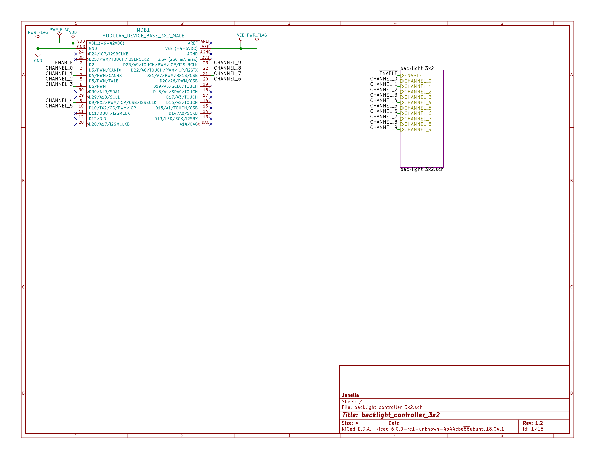

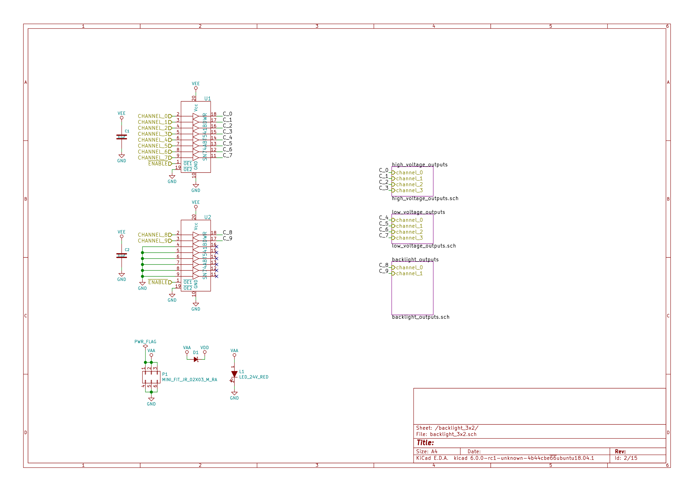


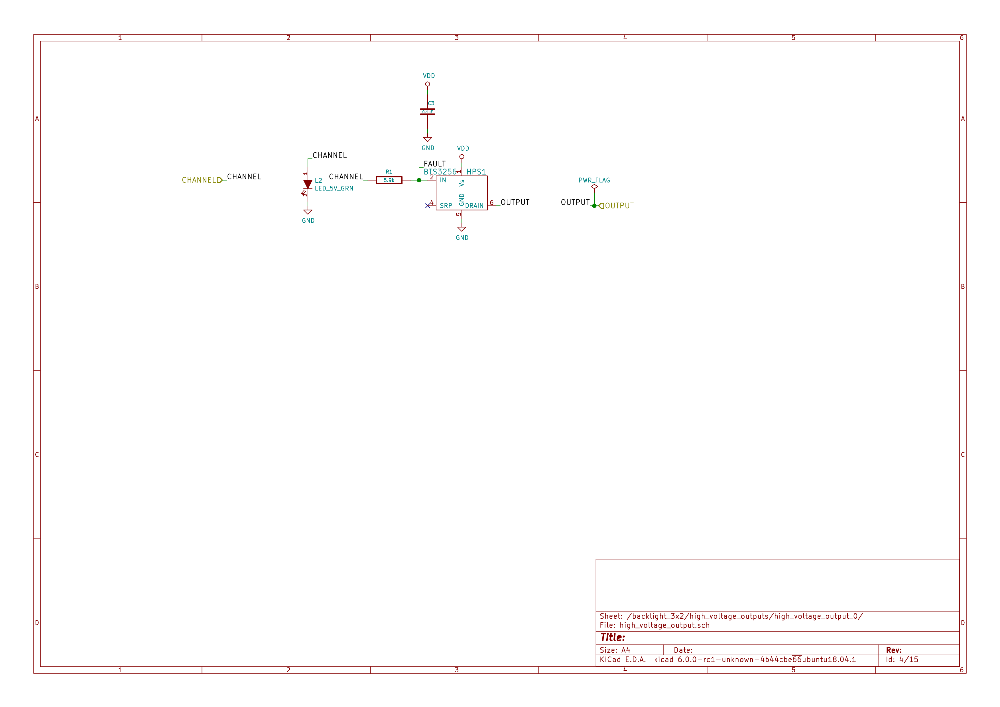


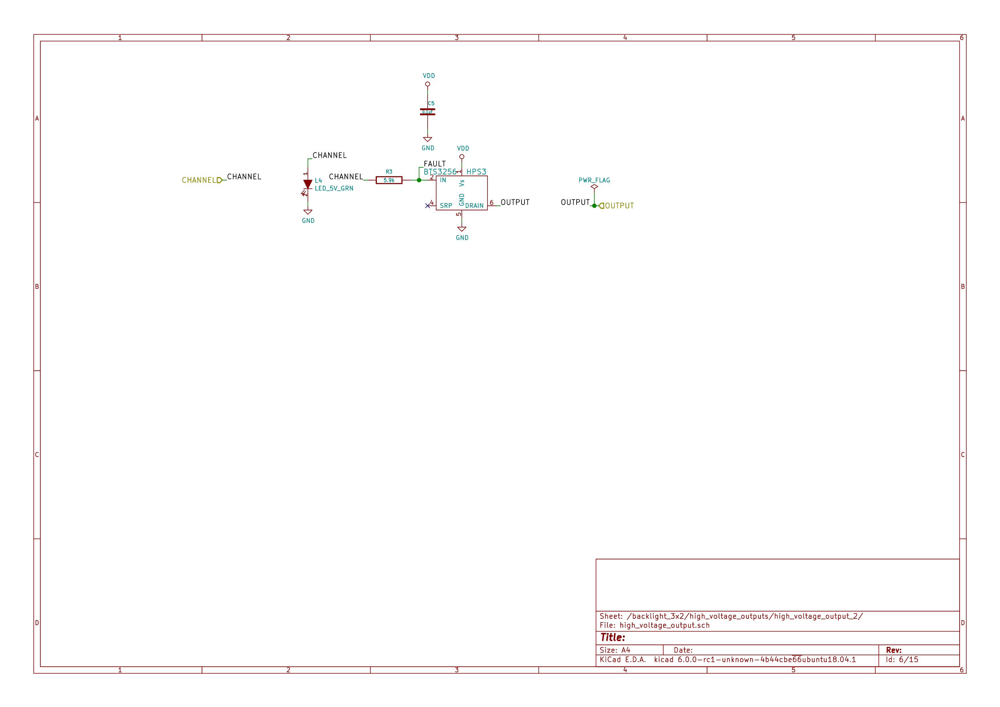


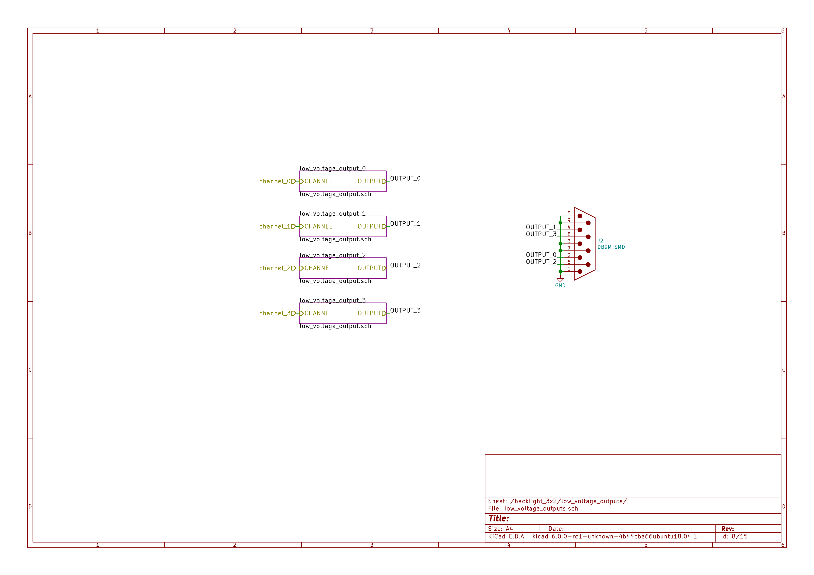


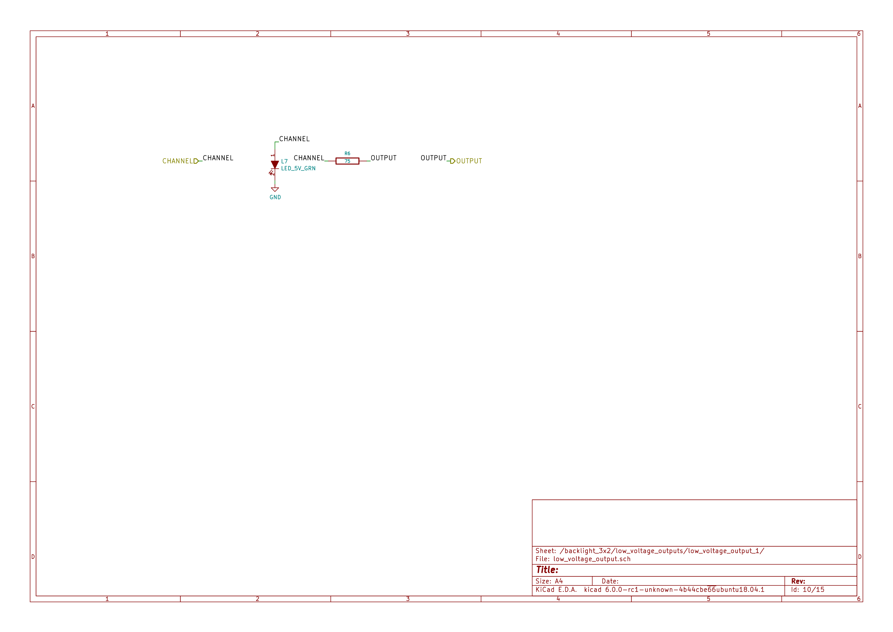

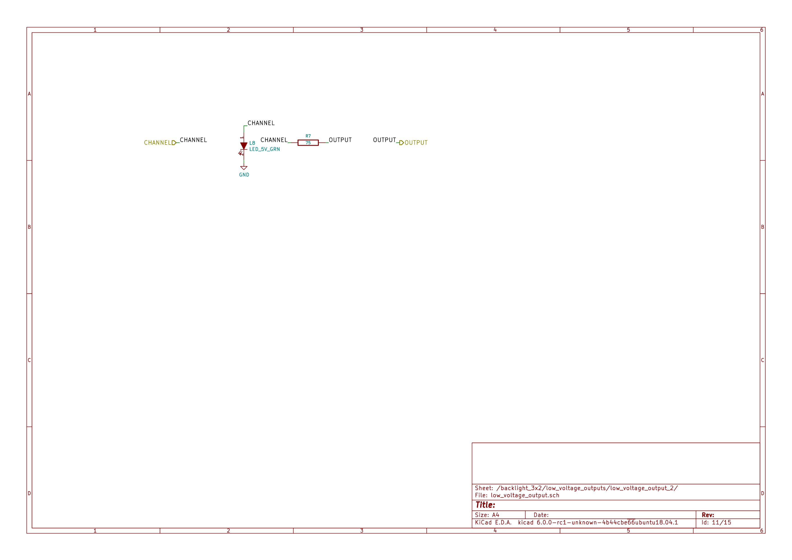


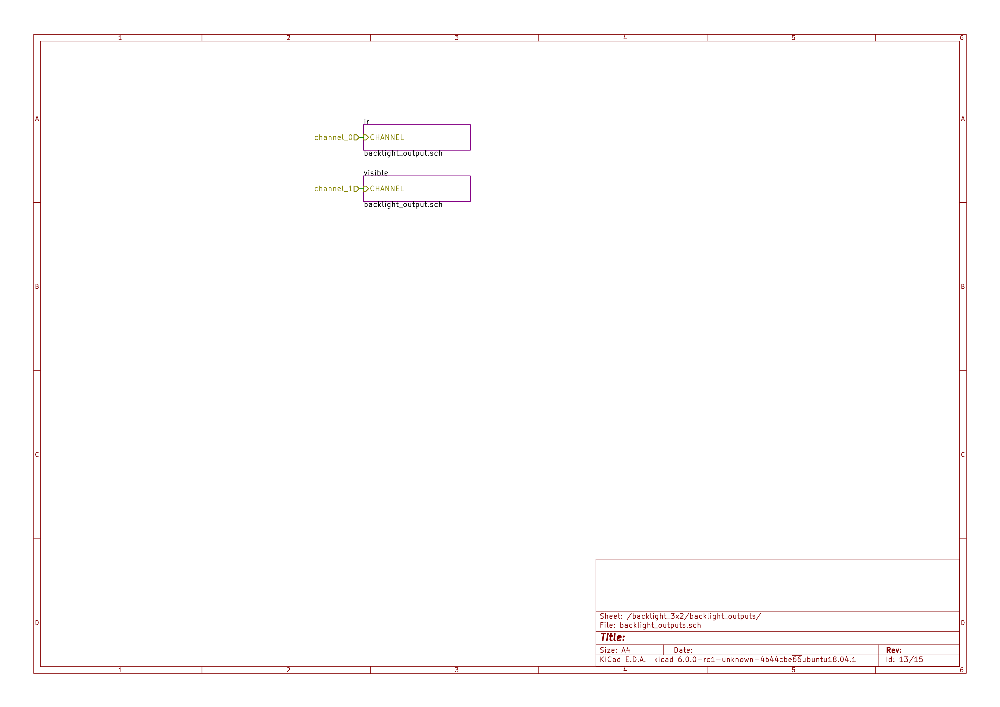

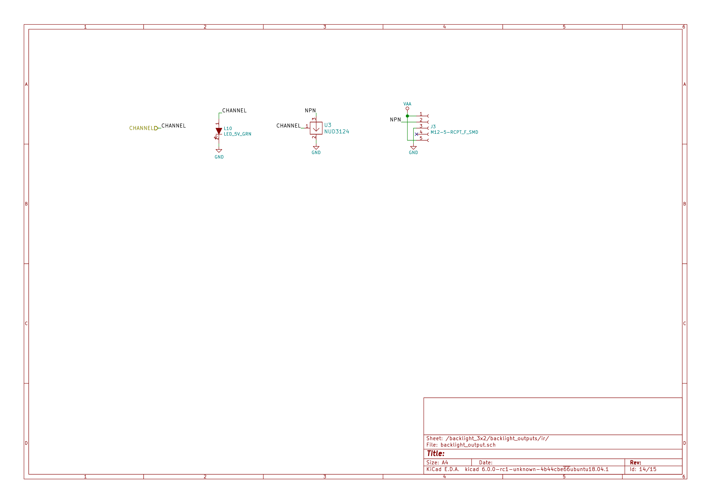


<a id="orgdfb6be5"></a>

### Gerbers

Send gerbers zip file to your favorite PCB manufacturer for fabrication.

[./hardware/backlight\_controller\_3x2/gerbers/backlight\_controller\_3x2\_v1.2.zip](./hardware/backlight_controller_3x2/gerbers/backlight_controller_3x2_v1.2.zip)

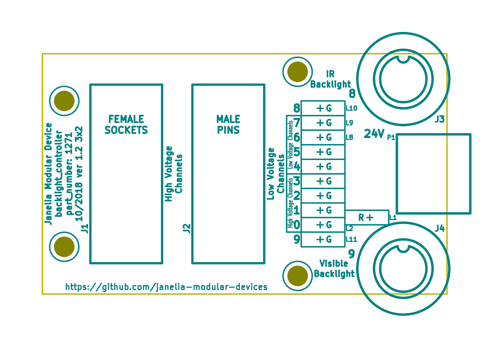

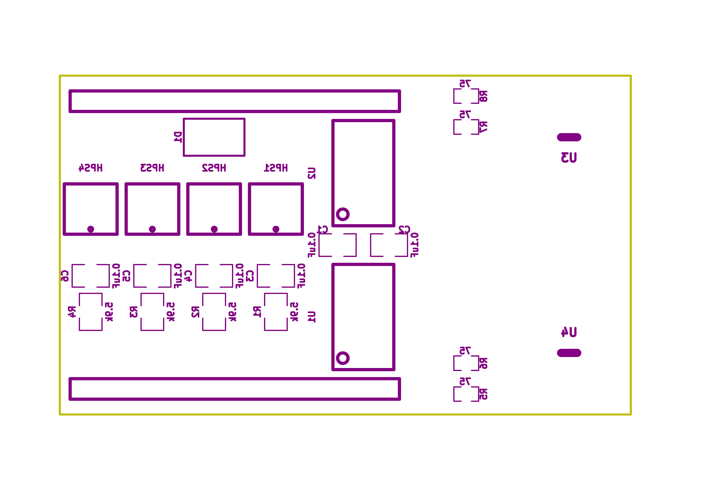


<a id="orgfcb574f"></a>

### Bill of Materials

1.  PCB Parts

    | Item | Reference(s)                    | Quantity | PartNumber         | Vendor  | Description                                                               |
    |---- |------------------------------- |-------- |------------------ |------- |------------------------------------------------------------------------- |
    | 1    | C1 C2 C3 C4 C5 C6               | 6        | 399-13229-1-ND     | digikey | CAP CER 0.1UF 50V 10% X7R 1210                                            |
    | 2    | D1                              | 1        | 568-11697-1-ND     | digikey | DIODE SCHOTTKY 45V 10A CFP15                                              |
    | 3    | HPS1 HPS2 HPS3 HPS4             | 4        | BTS3256DAUMA1CT-ND | digikey | IC SWITCH SMART LOWSIDE TO252-5                                           |
    | 4    | J1                              | 1        | 1195-4005-1-ND     | digikey | CONN D-SUB RCPT 9POS SMD SOLDER                                           |
    | 5    | J2                              | 1        | 1195-4006-1-ND     | digikey | CONN D-SUB PLUG 9POS SMD SOLDER                                           |
    | 6    | J3 J4                           | 2        | 277-10282-1-ND     | digikey | CONN FMALE INSERT 5POS SOLDER                                             |
    | 7    | L1                              | 1        | 350-1723-ND        | digikey | LED 2MM 24V VERTICAL RED PC MNT                                           |
    | 8    | L10 L11 L2 L3 L4 L5 L6 L7 L8 L9 | 10       | 350-1726-ND        | digikey | LED 2MM 5V VERTICAL GREEN PC MNT                                          |
    | 9    | MDB1                            | 2        | S1011E-16-ND       | digikey | 16 Position Header Through Hole Male Pins                                 |
    | 10   | P1                              | 1        | WM1353-ND          | digikey | CONN HEADER 6POS 4.2MM R/A TIN                                            |
    | 11   | R1 R2 R3 R4                     | 4        | P5.90KAACT-ND      | digikey | RES SMD 5.9k OHM 1% 1/2W 1210                                             |
    | 12   | R5 R6 R7 R8                     | 4        | P75.0CCT-ND        | digikey | RES SMD 75 OHM 1% 1/8W 0805                                               |
    | 13   | U1 U2                           | 2        | 296-14668-1-ND     | digikey | Buffer Non-Inverting 1 Element 8 Bit per Element Push-Pull Output 20-SOIC |
    | 14   | U3 U4                           | 2        | NUD3124LT1GOSCT-ND | digikey | IC INDCT LOAD DRVR AUTO SOT23                                             |

2.  Supplemental Parts

    | Item | Quantity | PartNumber   | Vendor  | Description                    |
    |---- |-------- |------------ |------- |------------------------------ |
    | 1    | 1        | 1866-2122-ND | digikey | AC/DC DESKTOP ADAPTER 24V 280W |
    | 2    | 1        | 1866-5006-ND | digikey | CORD IEC 320-C13 6FT BLACK     |
    | 3    | 2        | 277-10308-ND | digikey | CONN INSERT SHELL PRESS FIT    |

3.  Vendor Parts Lists

    [./hardware/backlight\_controller\_3x2/bom/digikey\_parts.csv](./hardware/backlight_controller_3x2/bom/digikey_parts.csv)

    [./hardware/backlight\_controller\_3x2/bom/supplemental\_digikey\_parts.csv](./hardware/backlight_controller_3x2/bom/supplemental_digikey_parts.csv)


<a id="org749812e"></a>

### Supplemental Documentation

1.  Assembly Instructions

    -   Solder surface mount and through hole components onto the pcb.


<a id="org3d3be24"></a>

## sleep\_assay\_wiring


<a id="orgce9b814"></a>

### Repository Information

-   **Name:** sleep\_assay\_wiring
-   **Version:** 1.0
-   **License:** Open-Source Hardware
-   **URL:** <https://github.com/janelia-kicad/sleep_assay_wiring>
-   **Author:** Peter Polidoro
-   **Email:** peterpolidoro@gmail.com

1.  Description


<a id="org5a82714"></a>

### Images


<a id="orge1c903e"></a>

### Schematic

[./hardware/sleep\_assay\_wiring/schematic/sleep\_assay\_wiring.pdf](./hardware/sleep_assay_wiring/schematic/sleep_assay_wiring.pdf)


<a id="org5e6b8ce"></a>

### Gerbers


<a id="org250630e"></a>

### Bill of Materials

1.  PCB Parts

    | Item | Reference(s)    | Quantity | PartNumber     | Vendor            | Description                                                     |
    |---- |--------------- |-------- |-------------- |----------------- |--------------------------------------------------------------- |
    | 1    | BL1             | 1        | MOBL\_300x300  | smartvisionlights | Maximum Operating Backlight 300x300                             |
    | 2    | CABLE1 CABLE2   | 2        | 277-8345-ND    | digikey           | CBL FMALE RA TO MALE 5POS 1.5M                                  |
    | 3    | CABLE3 CABLE4   | 2        | 1195-7211-ND   | digikey           | CABLE ASSY DB09 SHLD BEIGE 2M                                   |
    | 4    | CABLE5          | 1        | ACC-01-3000    | flir              | FLIR camera 8 pins 1m GPIO Cable Hirose HR25 Circular Connector |
    | 5    | CABLE6          | 1        | GC14333-ND     | digikey           | USB3.0-A-USB3.0-MICRO-B 3M GOLD                                 |
    | 6    | CAMERA1         | 1        | FL3-U3-13Y3M-C | flir              | 1280x1024 150 FPS Mono                                          |
    | 7    | D1 D2 D3        | 3        | 751-1213-ND    | digikey           | EMITTER IR 850NM 100MA RADIAL                                   |
    | 8    | F1 F2 F3 F4     | 4        | 381-2367-ND    | digikey           | FAN AXIAL 40X10MM 24VDC WIRE                                    |
    | 9    | FR1             | 1        | 289-1240-ND    | digikey           | LED FLEX RIBBON 24V WHT 4M                                      |
    | 10   | J1              | 1        | 277-2667-ND    | digikey           | CONN DSUB PLUG 9POS STR TERM BLK                                |
    | 11   | J2              | 1        | 277-2668-ND    | digikey           | CONN DSUB RCPT 9POS STR TERM BLK                                |
    | 12   | VM1 VM2 VM3 VM4 | 4        | 1670-1026-ND   | digikey           | VIBRATION MOTOR CYL 5V WIRE                                     |

2.  Supplemental Parts

    | Item | Quantity | PartNumber  | Vendor  | Description                    |
    |---- |-------- |----------- |------- |------------------------------ |
    | 1    | 3        | 492-1782-ND | digikey | LED HOLDER PNL CLIP 5MM BK NYL |
    |      |          |             |         |                                |

3.  Vendor Parts Lists

    [./hardware/sleep\_assay\_wiring/bom/digikey\_parts.csv](./hardware/sleep_assay_wiring/bom/digikey_parts.csv)

    [./hardware/sleep\_assay\_wiring/bom/flir\_parts.csv](./hardware/sleep_assay_wiring/bom/flir_parts.csv)

    [./hardware/sleep\_assay\_wiring/bom/smartvisionlights\_parts.csv](./hardware/sleep_assay_wiring/bom/smartvisionlights_parts.csv)

    [./hardware/sleep\_assay\_wiring/bom/supplemental\_digikey\_parts.csv](./hardware/sleep_assay_wiring/bom/supplemental_digikey_parts.csv)


<a id="org82b1103"></a>

### Supplemental Documentation

1.  Assembly Instructions
