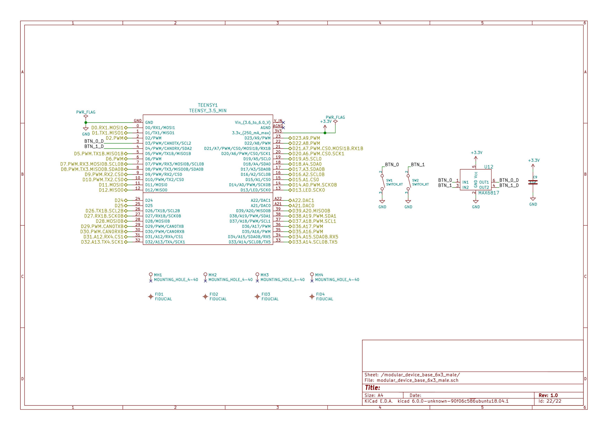

- [Repository Information](#orgffdaa40)
  - [Description](#orgba36317)
- [Images](#org7532679)
- [Usage Instructions](#orgb5d6167)
  - [Arduino Serial Monitor](#org3521713)
  - [Matlab](#orgb94a984)
- [Build Instructions](#orgc3f6ac3)
- [Software](#orgfd16adc)
- [Firmware](#org683c8ab)
  - [BacklightController](#org3c10d76)
    - [Library Information](#orgdc1e86d)
    - [API NAMES](#org5349c83)
    - [API GENERAL](#org1d2b913)
    - [Ancestors](#org639a81a)
    - [Clients](#orgd94bd4f)
    - [Devices](#org74ace56)
    - [More Detailed Modular Device Information](#org5e5479c)
    - [Installation Instructions](#orga133675)
  - [DigitalController](#orgfdae26b)
    - [Library Information](#orgc236c51)
    - [API NAMES](#orgd4ee98b)
    - [API GENERAL](#orge20931f)
    - [Ancestors](#org06ba571)
    - [Clients](#orgde97d57)
    - [Devices](#org31a51fd)
    - [More Detailed Modular Device Information](#org32d5e86)
    - [Installation Instructions](#orgea44f6d)
  - [SleepAssayController](#org173504e)
    - [Library Information](#org8d28a6c)
    - [API NAMES](#org4cc53ff)
    - [API GENERAL](#org9c14ae5)
    - [Ancestors](#orgb8d26f4)
    - [Clients](#org1d59f29)
    - [Devices](#orga6a2c9a)
    - [More Detailed Modular Device Information](#orgaa16f72)
    - [Installation Instructions](#orge037e37)
- [Hardware](#org335801b)
  - [backlight\_controller\_6x3](#org8a7c97f)
    - [Repository Information](#org39f396c)
    - [Images](#orgdedf167)
    - [Schematic](#org282789e)
    - [Gerbers](#orgb417311)
    - [Bill of Materials](#orge7e5628)
    - [Supplemental Documentation](#org787695c)
    - [Manufacturing Archive](#org98d1254)
  - [sleep\_assay\_wiring](#orga85bd4b)
    - [Repository Information](#orgdcfbb07)
    - [Images](#orgbafcf3e)
    - [Schematic](#orgfbde608)
    - [Gerbers](#orgd61ae9b)
    - [Bill of Materials](#orgd5fc426)
    - [Supplemental Documentation](#org25138e2)


<a id="orgffdaa40"></a>

# Repository Information

-   **Name:** sleep\_assay\_controller
-   **Version:** 2.1
-   **License:** BSD, Open-Source Hardware
-   **URL:** <https://github.com/janelia-modular-devices/sleep_assay_controller>
-   **Author:** Peter Polidoro
-   **Email:** peter@polidoro.io


<a id="orgba36317"></a>

## Description

This device controls the IR and visible backlights in the sleep assay rig along with the backlight cooling fans, white lights, buzzers and indicator lights.


<a id="org7532679"></a>

# Images


<a id="orgb5d6167"></a>

# Usage Instructions


<a id="org3521713"></a>

## Arduino Serial Monitor

```sh
     # Open terminal, set baud rate to 115200 and set to append newline to
     # each request sent to the device.
     ?
     # {
     #   "id": "?",
     #   "result": {
     #     "device_id": {
     #       "name": "sleep_assay_controller",
     #       "form_factor": "6x3",
     #       "serial_number": 0
     #     },
     #     "api": {
     #       "firmware": [
     #         "SleepAssayController"
     #       ],
     #       "verbosity": "NAMES",
     #       "functions": [
     #         "setIrBacklightAndFanOnAtPower",
     #         "setIrBacklightAndFanOnAtIntensity",
     #         "setVisibleBacklightAndIndicatorOnAtPower",
     #         "setVisibleBacklightAndIndicatorOnAtIntensity",
     #         "setWhiteLightAndIndicatorOnAtPower",
     #         "setBuzzerAndIndicatorOnAtPower",
     #         "getAssayStart",
     #         "getAssayEnd",
     #         "getAssayDuration",
     #         "getExperimentStart",
     #         "getExperimentEnd",
     #         "getExperimentDuration",
     #         "getEntrainmentStart",
     #         "getExperimentInfo",
     #         "getExperimentDayInfo",
     #         "addExperimentDay",
     #         "addExperimentDays",
     #         "addExperimentDayCopy",
     #         "addExperimentDayCopies",
     #         "removeLastExperimentDay",
     #         "removeAllExperimentDays",
     #         "setExperimentDayVisibleBacklight",
     #         "setExperimentDayWhiteLight",
     #         "setExperimentDayBuzzer",
     #         "getAssayStatus"
     #       ],
     #       "parameters": [
     #         "experiment_day",
     #         "visible_backlight_delay",
     #         "visible_backlight_duration",
     #         "buzzer_delay",
     #         "buzzer_duration",
     #         "day_count"
     #       ],
     #       "properties": [
     #         "visibleBacklightFrequency",
     #         "visibleBacklightDutyCycle",
     #         "whiteLightEntrainmentPower",
     #         "whiteLightRecoveryPower",
     #         "whiteLightStartTime",
     #         "whiteLightOnDuration",
     #         "buzzerOnDurationMin",
     #         "buzzerOnDurationMax",
     #         "buzzerWaitMin",
     #         "buzzerWaitMax",
     #         "cameraTriggerFrequency",
     #         "entrainmentDuration",
     #         "recoveryDuration",
     #         "testingDayDuration"
     #       ],
     #       "callbacks": [
     #         "setIrBacklightAndFanOn",
     #         "setIrBacklightAndFanOff",
     #         "toggleIrBacklightAndFan",
     #         "setVisibleBacklightAndIndicatorOn",
     #         "setVisibleBacklightAndIndicatorOff",
     #         "toggleVisibleBacklightAndIndicator",
     #         "setWhiteLightAndIndicatorOn",
     #         "setWhiteLightAndIndicatorOff",
     #         "toggleWhiteLightAndIndicator",
     #         "setBuzzerAndIndicatorOn",
     #         "setBuzzerAndIndicatorOff",
     #         "toggleBuzzerAndIndicator",
     #         "toggleAll",
     #         "startCameraTrigger",
     #         "stopCameraTrigger",
     #         "runAssay",
     #         "testAssay",
     #         "stopAssay"
     #       ]
     #     }
     #   }
     # }
     #
     # First, set all properties to defaults.
     #
     setPropertiesToDefaults [ALL]
     # {
     #   "id": "setPropertiesToDefaults",
     #   "result": null
     # }
     #
     # Then get epoch time on the client computer using one of any number of
     # ways.
     #
     # Web Page:
     #
     # [[https://www.epochconverter.com/]]
     #
     # Bash: ndate +%s
     #
     # Example: epoch_time = 1543617175
     #
     # Set the time on the device:
     #
     setTime 1543617175
     # {
     #   "id": "setTime",
     #   "result": null
     # }
     #
     # Check the date and time make sure this matches the local date and
     # time.
     #
     now
     # {
     #   "id": "now",
     #   "result": {
     #     "year": 2018,
     #     "month": 11,
     #     "day": 30,
     #     "hour": 18,
     #     "minute": 32,
     #     "second": 56
     #   }
     # }
     #
     # If it is off by a few hours, the time zone may need to be adjusted.
     # For example, for daylight savings.
     #
     timeZoneOffset setValue -5
     # {
     #   "id": "timeZoneOffset",
     #   "result": -5
     # }
     # Set IR backlight calibration
     irBacklightPowerToIntensityRatio setValue [5.35]
     # {
     #   "id": "irBacklightPowerToIntensityRatio",
     #   "result": [
     #     5.350000
     #   ]
     # }
     # Set visible backlight calibration
     visibleBacklightPowerToIntensityRatio setValue [14.62]
     # {
     #   "id": "visibleBacklightPowerToIntensityRatio",
     #   "result": [
     #     14.620000
     #   ]
     # }
     irBacklightIntensityMax setValue [12]
     # {
     #   "id": "irBacklightIntensityMax",
     #   "result": [
     #     12.000000
     #   ]
     # }
     getPropertyValues [SleepAssayController]
     # {
     #   "id": "getPropertyValues",
     #   "result": {
     #     "visibleBacklightFrequency": 10.000000,
     #     "visibleBacklightDutyCycle": 50,
     #     "whiteLightEntrainmentPower": 50,
     #     "whiteLightRecoveryPower": 50,
     #     "whiteLightStartTime": 9,
     #     "whiteLightOnDuration": 12,
     #     "buzzerOnDurationMin": 1,
     #     "buzzerOnDurationMax": 4,
     #     "buzzerWaitMin": 1,
     #     "buzzerWaitMax": 3,
     #     "cameraTriggerFrequency": 0.500000,
     #     "entrainmentDuration": 2,
     #     "recoveryDuration": 2,
     #     "testingDayDuration": 24
     #   }
     # }
     getAssayDuration
     # {
     #   "id":"getAssayDuration",
     #   "result":4
     # }
     entrainmentDuration setValue 1
     # {
     #   "id":"entrainmentDuration",
     #   "result":1
     # }
     recoveryDuration setValue 1
     # {
     #   "id":"recoveryDuration",
     #   "result":1
     # }
     getAssayDuration
     # {
     #   "id":"getAssayDuration",
     #   "result":2
     # }
     getExperimentInfo
     # {
     #   "id":"getExperimentInfo",
     #   "result":[]
     # }
     addExperimentDay
     # {
     #   "id":"addExperimentDay",
     #   "result":0
     # }
     getExperimentInfo
     # {
     #   "id": "getExperimentInfo",
     #   "result": [
     #     {
     #       "visible_backlight_intensity": 0.000000,
     #       "visible_backlight_delay": 0.000000,
     #       "visible_backlight_duration": 0.000000,
     #       "white_light_power": 0.000000,
     #       "buzzer_power": 0.000000,
     #       "buzzer_delay": 0.000000,
     #       "buzzer_duration": 0.000000
     #     }
     #   ]
     # }
     setExperimentDayVisibleBacklight 0 5.0 0 12
     # {
     #   "id": "setExperimentDayVisibleBacklight",
     #   "result": {
     #     "visible_backlight_intensity": 5.000000,
     #     "visible_backlight_delay": 0.000000,
     #     "visible_backlight_duration": 12.000000,
     #     "white_light_power": 75.000000,
     #     "buzzer_power": 0.000000,
     #     "buzzer_delay": 0.000000,
     #     "buzzer_duration": 0.000000
     #   }
     # }
     setExperimentDayWhiteLight 0 75
     # {
     #   "id": "setExperimentDayWhiteLight",
     #   "result": {
     #     "visible_backlight_intensity": 0.000000,
     #     "visible_backlight_delay": 0.000000,
     #     "visible_backlight_duration": 0.000000,
     #     "white_light_power": 75.000000,
     #     "buzzer_power": 0.000000,
     #     "buzzer_delay": 0.000000,
     #     "buzzer_duration": 0.000000
     #   }
     # }
     addExperimentDayCopy 0
     # {
     #   "id":"addExperimentDayCopy",
     #   "result":1
     # }
     setExperimentDayBuzzer 1 50 3 12
     # {
     #   "id": "setExperimentDayBuzzer",
     #   "result": {
     #     "visible_backlight_intensity": 5.000000,
     #     "visible_backlight_delay": 0.000000,
     #     "visible_backlight_duration": 12.000000,
     #     "white_light_power": 75.000000,
     #     "buzzer_power": 50.000000,
     #     "buzzer_delay": 3.000000,
     #     "buzzer_duration": 12.000000
     #   }
     # }
     getExperimentInfo
     # {
     #   "id": "getExperimentInfo",
     #   "result": [
     #     {
     #       "visible_backlight_intensity": 5.000000,
     #       "visible_backlight_delay": 0.000000,
     #       "visible_backlight_duration": 12.000000,
     #       "white_light_power": 75.000000,
     #       "buzzer_power": 0.000000,
     #       "buzzer_delay": 0.000000,
     #       "buzzer_duration": 0.000000
     #     },
     #     {
     #       "visible_backlight_intensity": 5.000000,
     #       "visible_backlight_delay": 0.000000,
     #       "visible_backlight_duration": 12.000000,
     #       "white_light_power": 75.000000,
     #       "buzzer_power": 50.000000,
     #       "buzzer_delay": 3.000000,
     #       "buzzer_duration": 12.000000
     #     }
     #   ]
     # }
     getExperimentDuration
     # {
     #   "id": "getExperimentDuration",
     #   "result": 2
     # }
     getAssayDuration
     # {
     #   "id": "getAssayDuration",
     #   "result": 4
     # }
     testAssay
     # {
     #   "id": "testAssay",
     #   "result": null
     # }
     getAssayStatus
     # {
     #   "id": "getAssayStatus",
     #   "result": {
     #     "time_now": 1543617266,
     #     "date_time_now": {
     #       "year": 2018,
     #       "month": 11,
     #       "day": 30,
     #       "hour": 18,
     #       "minute": 34,
     #       "second": 26
     #     },
     #     "assay_day": 0.666667,
     #     "phase": "ENTRAINMENT",
     #     "phase_day": 0.666667,
     #     "visible_backlight_intensity": 0.000000,
     #     "white_light_power": 50.000000,
     #     "buzzer_power": 0.000000,
     #     "buzzing": false,
     #     "testing": true
     #   }
     # }
     stopAssay
     # {
     #   "id": "stopAssay",
     #   "result": null
     # }
     runAssay
     # {
     #   "id": "runAssay",
     #   "result": null
     # }
     getAssayEnd
     # {
     #   "id": "getAssayEnd",
     #   "result": {
     #     "year": 2018,
     #     "month": 12,
     #     "day": 4,
     #     "hour": 9,
     #     "minute": 0,
     #     "second": 0
     #   }
     # }
     stopAssay
     # {
     #   "id": "stopAssay",
     #   "result": null
     # }
     removeAllExperimentDays
     # {
     #   "id": "removeAllExperimentDays",
     #   "result": null
     # }
     setIrBacklightAndFanOff
     # {
     #   "id": "setIrBacklightAndFanOff",
     #   "result": null
     # }
```


<a id="orgb94a984"></a>

## Matlab

```matlab
     getAvailableComPorts()
     serial_port = 'COM9'; % example
     dev = ModularClient(serial_port);
     dev.open();
     dev.setPropertiesToDefaults({'ALL'});
     % look up time zone offset for your location
     % taking into account daylight savings time
     % if necessary
     % e.g.
     % U.S. Eastern = -5
     % U.S. Eastern daylight savings = -4
     time_zone_offset = -4;
     dev.timeZoneOffset('setValue',time_zone_offset);
     dev.setTime(etime(clock,[1970,1,1,0,0,0]));
     n = dev.now();
     t = clock;
     dev.adjustTime((t(4) - n.hour)*60*60);
     dev.now()
     %   year: 2018
     %  month: 11
     %    day: 30
     %   hour: 17
     % minute: 44
     % second: 59
     % check to make sure this matches the local date and time
     % Set IR backlight calibration
     dev.irBacklightPowerToIntensityRatio('setValue',{5.35});
     % Set visible backlight calibration
     dev.visibleBacklightPowerToIntensityRatio('setValue',{14.62});
     dev.irBacklightIntensityMax('setValue',{12});
     dev.getPropertyValues({'SleepAssayController'})
     %  visibleBacklightFrequency: 10.0
     %  visibleBacklightDutyCycle: 50
     % whiteLightEntrainmentPower: 50
     %    whiteLightRecoveryPower: 50
     %        whiteLightStartTime: 9
     %       whiteLightOnDuration: 12
     %        buzzerOnDurationMin: 1
     %        buzzerOnDurationMax: 4
     %              buzzerWaitMin: 1
     %              buzzerWaitMax: 3
     %     cameraTriggerFrequency: 0.5
     %        entrainmentDuration: 2
     %           recoveryDuration: 2
     %         testingDayDuration: 24
     dev.getAssayDuration()
     % 4
     dev.entrainmentDuration('setValue',1);
     dev.recoveryDuration('setValue',1);
     dev.getAssayDuration()
     % 2
     dev.getExperimentInfo()
     % Empty cell array: 0-by-1
     dev.addExperimentDay()
     % 0
     info = dev.getExperimentInfo();
     info{1}
     % visible_backlight_intensity: 0.0
     %     visible_backlight_delay: 0.0
     %  visible_backlight_duration: 0.0
     %           white_light_power: 0.0
     %                buzzer_power: 0.0
     %                buzzer_delay: 0.0
     %             buzzer_duration: 0.0
     experiment_day = 0;
     visible_backlight_intensity = 5.0;
     visible_backlight_delay = 0;
     visible_backlight_duration = 12;
     dev.setExperimentDayVisibleBacklight(experiment_day, ...
                                          visible_backlight_intensity, ...
                                          visible_backlight_delay, ...
                                          visible_backlight_duration);
     white_light_power = 75;
     dev.setExperimentDayWhiteLight(experiment_day,white_light_power);
     dev.addExperimentDayCopy(0)
     % 1
     experiment_day = 1;
     buzzer_power = 50;
     buzzer_delay = 3;
     buzzer_duration = 12;
     dev.setExperimentDayBuzzer(experiment_day, ...
                                buzzer_power, ...
                                buzzer_delay, ...
                                buzzer_duration);
     info = dev.getExperimentInfo();
     info{2}
     % visible_backlight_intensity: 5.0
     %     visible_backlight_delay: 0.0
     %  visible_backlight_duration: 12.0
     %           white_light_power: 75.0
     %                buzzer_power: 50.0
     %                buzzer_delay: 3.0
     %             buzzer_duration: 12.0
     dev.getExperimentDuration()
     % 2
     dev.getAssayDuration()
     % 4
     dev.testAssay();
     dev.getAssayStatus()
     %                    time_now: 1543618497
     %               date_time_now: [1x1 struct]
     %                   assay_day: 0.666667
     %                       phase: 'ENTRAINMENT'
     %                   phase_day: 0.666667
     % visible_backlight_intensity: 0
     %           white_light_power: 50
     %                buzzer_power: 0
     %                     buzzing: 0
     %                     testing: 1
     dev.runAssay();
     dev.getAssayEnd()
     %   year: 2018
     %  month: 12
     %    day: 4
     %   hour: 9
     % minute: 0
     % second: 0
     dev.stopAssay()
     dev.removeAllExperimentDays()
     dev.setIrBacklightAndFanOff()
```


<a id="orgc3f6ac3"></a>

# Build Instructions


<a id="orgfd16adc"></a>

# Software


<a id="org683c8ab"></a>

# Firmware


<a id="org3c10d76"></a>

## BacklightController


<a id="orgdc1e86d"></a>

### Library Information

-   **Name:** BacklightController
-   **Version:** 4.0.2
-   **License:** BSD
-   **URL:** <https://github.com/janelia-arduino/BacklightController>
-   **Author:** Peter Polidoro
-   **Email:** peterpolidoro@gmail.com

1.  Description

    Modular device backlight controller library.


<a id="org5349c83"></a>

### API NAMES

```js
    {
      "id": "getApi",
      "result": {
        "firmware": [
          "BacklightController"
        ],
        "verbosity": "NAMES",
        "functions": [
          "setAllIrBacklightsOnAtPower",
          "setAllIrBacklightsOnAtIntensity",
          "setIrBacklightOn",
          "setIrBacklightOnAtPower",
          "setIrBacklightOnAtIntensity",
          "setIrBacklightOff",
          "toggleIrBacklight",
          "getIrBacklightPowersWhenOn",
          "getIrBacklightIntensitiesWhenOn",
          "getIrBacklightPowers",
          "getIrBacklightIntensities",
          "getIrBacklightPowerBounds",
          "getIrBacklightIntensityBounds",
          "irBacklightPowerToIntensities",
          "irBacklightIntensityToPowers",
          "setAllVisibleBacklightsOnAtPower",
          "setAllVisibleBacklightsOnAtIntensity",
          "setVisibleBacklightOn",
          "setVisibleBacklightOnAtPower",
          "setVisibleBacklightOnAtIntensity",
          "setVisibleBacklightOff",
          "toggleVisibleBacklight",
          "getVisibleBacklightPowersWhenOn",
          "getVisibleBacklightIntensitiesWhenOn",
          "getVisibleBacklightPowers",
          "getVisibleBacklightIntensities",
          "getVisibleBacklightPowerBounds",
          "getVisibleBacklightIntensityBounds",
          "visibleBacklightPowerToIntensities",
          "visibleBacklightIntensityToPowers",
          "setAllHighVoltagesOnAtPower",
          "setHighVoltageOn",
          "setHighVoltageOnAtPower",
          "setHighVoltageOff",
          "toggleHighVoltage",
          "getHighVoltagePowersWhenOn",
          "getHighVoltagePowers",
          "getHighVoltagePowerBounds",
          "setAllLowVoltagesOnAtPower",
          "setLowVoltageOn",
          "setLowVoltageOnAtPower",
          "setLowVoltageOff",
          "toggleLowVoltage",
          "getLowVoltagePowersWhenOn",
          "getLowVoltagePowers",
          "getLowVoltagePowerBounds"
        ],
        "parameters": [
          "intensity",
          "ir_backlight",
          "visible_backlight",
          "high_voltage",
          "low_voltage"
        ],
        "properties": [
          "irBacklightPowerToIntensityRatio",
          "irBacklightIntensityMax",
          "visibleBacklightPowerToIntensityRatio",
          "visibleBacklightIntensityMax",
          "highVoltagePowerMax",
          "lowVoltagePowerMax",
          "irBacklightSwitchingFrequencyMax",
          "visibleBacklightSwitchingFrequencyMax",
          "highVoltageSwitchingFrequencyMax",
          "lowVoltageSwitchingFrequencyMax"
        ],
        "callbacks": [
          "setAllIrBacklightsOn",
          "setAllIrBacklightsOff",
          "toggleAllIrBacklights",
          "setAllVisibleBacklightsOn",
          "setAllVisibleBacklightsOff",
          "toggleAllVisibleBacklights",
          "setAllHighVoltagesOn",
          "setAllHighVoltagesOff",
          "toggleAllHighVoltages",
          "setAllLowVoltagesOn",
          "setAllLowVoltagesOff",
          "toggleAllLowVoltages"
        ]
      }
    }
```


<a id="org1d2b913"></a>

### API GENERAL

<./firmware/BacklightController/api/>


<a id="org639a81a"></a>

### Ancestors

<https://github.com/janelia-arduino/ModularServer>

<https://github.com/janelia-arduino/ModularDeviceBase>

<https://github.com/janelia-arduino/DigitalController>


<a id="orgd94bd4f"></a>

### Clients


<a id="org74ace56"></a>

### Devices

<https://github.com/janelia-modular-devices/modular_device_base>

<https://github.com/janelia-modular-devices/backlight_controller>


<a id="org5e5479c"></a>

### More Detailed Modular Device Information

<https://github.com/janelia-modular-devices/modular-devices>


<a id="orga133675"></a>

### Installation Instructions

<https://github.com/janelia-arduino/arduino-libraries>


<a id="orgfdae26b"></a>

## DigitalController


<a id="orgc236c51"></a>

### Library Information

-   **Name:** DigitalController
-   **Version:** 2.2.1
-   **License:** BSD
-   **URL:** <https://github.com/janelia-arduino/DigitalController>
-   **Author:** Peter Polidoro
-   **Email:** peterpolidoro@gmail.com

1.  Description

    Modular device digital output controller library.


<a id="orgd4ee98b"></a>

### API NAMES

```js
    {
      "id": "getApi",
      "result": {
        "firmware": [
          "DigitalController"
        ],
        "verbosity": "NAMES",
        "functions": [
          "allEnabled",
          "setPowerWhenOn",
          "setPowersWhenOn",
          "setAllPowersWhenOn",
          "setAllPowersWhenOnToMax",
          "getPowersWhenOn",
          "getPowers",
          "setChannelOn",
          "setChannelOnAtPower",
          "setChannelOff",
          "setChannelsOn",
          "setChannelsOnAtPower",
          "setChannelsOff",
          "toggleChannel",
          "toggleChannels",
          "setAllChannelsOnAtPower",
          "setChannelOnAllOthersOff",
          "setChannelOffAllOthersOn",
          "setChannelsOnAllOthersOff",
          "setChannelsOffAllOthersOn",
          "channelIsOn",
          "getChannelsOn",
          "getChannelsOff",
          "getChannelCount",
          "addPwm",
          "startPwm",
          "addRecursivePwm",
          "startRecursivePwm",
          "stopPwm",
          "stopAllPwm",
          "getChannelsPwmIndexes",
          "getPwmInfo",
          "getPowerBounds"
        ],
        "parameters": [
          "channel",
          "channels",
          "power",
          "powers",
          "delay",
          "period",
          "on_duration",
          "count",
          "pwm_index",
          "periods",
          "on_durations"
        ],
        "properties": [
          "channelCount",
          "powerMax"
        ],
        "callbacks": [
          "enableAll",
          "disableAll",
          "toggleAllChannels",
          "setAllChannelsOn",
          "setAllChannelsOff"
        ]
      }
    }
```


<a id="orge20931f"></a>

### API GENERAL

<./firmware/DigitalController/api/>


<a id="org06ba571"></a>

### Ancestors

<https://github.com/janelia-arduino/ModularServer>

<https://github.com/janelia-arduino/ModularDeviceBase>


<a id="orgde97d57"></a>

### Clients


<a id="org31a51fd"></a>

### Devices

<https://github.com/janelia-modular-devices/modular_device_base>


<a id="org32d5e86"></a>

### More Detailed Modular Device Information

<https://github.com/janelia-modular-devices/modular-devices>


<a id="orgea44f6d"></a>

### Installation Instructions

<https://github.com/janelia-arduino/arduino-libraries>


<a id="org173504e"></a>

## SleepAssayController


<a id="org8d28a6c"></a>

### Library Information

-   **Name:** SleepAssayController
-   **Version:** 2.0.0
-   **License:** BSD
-   **URL:** <https://github.com/janelia-arduino/SleepAssayController>
-   **Author:** Peter Polidoro
-   **Email:** peterpolidoro@gmail.com

1.  Description

    Modular device sleep assay controller library.


<a id="org4cc53ff"></a>

### API NAMES

```js
    {
      "id": "getApi",
      "result": {
        "firmware": [
          "SleepAssayController"
        ],
        "verbosity": "NAMES",
        "functions": [
          "setIrBacklightAndFanOnAtPower",
          "setIrBacklightAndFanOnAtIntensity",
          "setVisibleBacklightAndIndicatorOnAtPower",
          "setVisibleBacklightAndIndicatorOnAtIntensity",
          "setWhiteLightAndIndicatorOnAtPower",
          "setBuzzerAndIndicatorOnAtPower",
          "getAssayStart",
          "getAssayEnd",
          "getAssayDuration",
          "getExperimentStart",
          "getExperimentEnd",
          "getExperimentDuration",
          "getEntrainmentStart",
          "getExperimentInfo",
          "getExperimentDayInfo",
          "addExperimentDay",
          "addExperimentDays",
          "addExperimentDayCopy",
          "addExperimentDayCopies",
          "removeLastExperimentDay",
          "removeAllExperimentDays",
          "setExperimentDayVisibleBacklight",
          "setExperimentDayWhiteLight",
          "setExperimentDayBuzzer",
          "getAssayStatus"
        ],
        "parameters": [
          "experiment_day",
          "visible_backlight_delay",
          "visible_backlight_duration",
          "buzzer_delay",
          "buzzer_duration",
          "day_count"
        ],
        "properties": [
          "visibleBacklightFrequency",
          "visibleBacklightDutyCycle",
          "whiteLightEntrainmentPower",
          "whiteLightRecoveryPower",
          "whiteLightStartTime",
          "whiteLightOnDuration",
          "buzzerOnDurationMin",
          "buzzerOnDurationMax",
          "buzzerWaitMin",
          "buzzerWaitMax",
          "cameraTriggerFrequency",
          "entrainmentDuration",
          "recoveryDuration",
          "testingDayDuration"
        ],
        "callbacks": [
          "setIrBacklightAndFanOn",
          "setIrBacklightAndFanOff",
          "toggleIrBacklightAndFan",
          "setVisibleBacklightAndIndicatorOn",
          "setVisibleBacklightAndIndicatorOff",
          "toggleVisibleBacklightAndIndicator",
          "setWhiteLightAndIndicatorOn",
          "setWhiteLightAndIndicatorOff",
          "toggleWhiteLightAndIndicator",
          "setBuzzerAndIndicatorOn",
          "setBuzzerAndIndicatorOff",
          "toggleBuzzerAndIndicator",
          "toggleAll",
          "startCameraTrigger",
          "stopCameraTrigger",
          "runAssay",
          "testAssay",
          "stopAssay"
        ]
      }
    }
```


<a id="org9c14ae5"></a>

### API GENERAL

<./firmware/SleepAssayController/api/>


<a id="orgb8d26f4"></a>

### Ancestors

<https://github.com/janelia-arduino/ModularServer>

<https://github.com/janelia-arduino/ModularDeviceBase>

<https://github.com/janelia-arduino/DigitalController>

<https://github.com/janelia-arduino/BacklightController>


<a id="org1d59f29"></a>

### Clients


<a id="orga6a2c9a"></a>

### Devices

<https://github.com/janelia-modular-devices/modular_device_base>

<https://github.com/janelia-modular-devices/backlight_controller>

<https://github.com/janelia-modular-devices/sleep_assay_controller>


<a id="orgaa16f72"></a>

### More Detailed Modular Device Information

<https://github.com/janelia-modular-devices/modular-devices>


<a id="orge037e37"></a>

### Installation Instructions

<https://github.com/janelia-arduino/arduino-libraries>


<a id="org335801b"></a>

# Hardware


<a id="org8a7c97f"></a>

## backlight\_controller\_6x3


<a id="org39f396c"></a>

### Repository Information

-   **Name:** backlight\_controller\_6x3
-   **Version:** 1.0
-   **License:** Open-Source Hardware
-   **URL:** <https://github.com/janelia-kicad/backlight_controller_6x3>
-   **Author:** Peter Polidoro
-   **Email:** peter@polidoro.io

1.  Description

    This board controls up to four Smart Vision backlights with IR and visible channels plus additional high and low power channel outputs.


<a id="orgdedf167"></a>

### Images


<a id="org282789e"></a>

### Schematic

[./hardware/backlight\_controller\_6x3/schematic/backlight\_controller\_6x3.pdf](./hardware/backlight_controller_6x3/schematic/backlight_controller_6x3.pdf)





<a id="orgb417311"></a>

### Gerbers


<a id="orge7e5628"></a>

### Bill of Materials

1.  PCB Parts

    | Item | Reference(s)                                                | Quantity | Manufacturer Part Number | Description                                                       |
    |---- |----------------------------------------------------------- |-------- |------------------------ |----------------------------------------------------------------- |
    | 1    | C1 C2                                                       | 2        | C2012X5R1V106M085AC      | CAP CER 10UF 35V X5R                                              |
    | 2    | C3 C4 C5 C6 C7 C8 C9                                        | 7        | C0805T104K5RAL7800       | CAP CER 0.1UF 50V X7R                                             |
    | 3    | D1 D10 D11 D12 D13 D14 D15 D16 D17 D2 D3 D4 D5 D6 D7 D8 D9  | 17       | LTST-C170GKT             | LED GREEN CLEAR SMD                                               |
    | 4    | HPS1 HPS2 HPS3 HPS4                                         | 4        | BTS3256DAUMA1            | IC SWITCH SMART LOWSIDE                                           |
    | 5    | J1                                                          | 1        | 09551156612741           | CONN D-SUB RCPT 9POS SMD SOLDER                                   |
    | 6    | J10 J3 J4 J5 J6 J7 J8 J9                                    | 8        | 1411976                  | CONN FMALE INSERT 5POS SOLDER                                     |
    | 7    | J2                                                          | 1        | 09551296812741           | CONN D-SUB PLUG 9POS SMD SOLDER                                   |
    | 8    | P1                                                          | 1        | 0039301060               | CONN HEADER 6POS 4.2MM R/A TIN                                    |
    | 9    | R1                                                          | 1        | ERJ-6ENF2201V            | RES SMD 2.2K OHM 1% 1/8W                                          |
    | 10   | R10 R2 R4 R6 R8                                             | 5        | ERJ-6ENF5901V            | RES SMD 5.9K OHM 1% 1/8W                                          |
    | 11   | R11 R13 R15 R17 R19 R20 R21 R22 R23 R24 R25 R26 R3 R5 R7 R9 | 16       | ERJ-6ENF2870V            | RES SMD 287 OHM 1% 1/8W                                           |
    | 12   | R12 R14 R16 R18                                             | 4        | ERJ-6ENF75R0V            | RES SMD 75 OHM 1% 1/8W                                            |
    | 13   | REG1                                                        | 1        | R-78C5.0-1.0             | CONV DC/DC 1A 5V OUT SIP VERT                                     |
    | 14   | SW1 SW2                                                     | 2        | KT11P4SM34LFS            | SWITCH TACTILE SPST-NO 1VA 32V                                    |
    | 15   | TEENSY1                                                     | 1        | DEV-14056                | TEENSY 3.5 HDRS K64 EVAL BRD                                      |
    | 16   | U1 U2                                                       | 2        | SN74ABT541BDWR           | Buffer Non-Inverting 1 Element 8 Bit per Element Push-Pull Output |
    | 17   | U10 U11 U3 U4 U5 U6 U7 U8 U9                                | 9        | NUD3124LT1G              | IC INDCT LOAD DRVR AUTO                                           |
    | 18   | U12                                                         | 1        | MAX6817EUT+T             | IC DEBOUNCER SWITCH DUAL                                          |

2.  Supplemental Parts

    | Item | Quantity | Manufacturer Part Number   | Description                    |
    |---- |-------- |-------------------------- |------------------------------ |
    | 1    | 1        | GST280A24-C6P              | AC/DC DESKTOP ADAPTER 24V 280W |
    | 2    | 1        | CORD IEC 320-C13 6FT BLACK | CORD IEC 320-C13 6FT BLACK     |

3.  Vendor Parts Lists

    [./hardware/backlight\_controller\_6x3/bom/Digi-Key\_parts.csv](./hardware/backlight_controller_6x3/bom/Digi-Key_parts.csv)
    
    [./hardware/backlight\_controller\_6x3/bom/supplemental\_Digi-Key\_parts.csv](./hardware/backlight_controller_6x3/bom/supplemental_Digi-Key_parts.csv)


<a id="org787695c"></a>

### Supplemental Documentation

1.  Assembly Instructions

    -   Solder surface mount and through hole components onto the pcb.


<a id="org98d1254"></a>

### Manufacturing Archive

Send manufacturing zip file to your favorite PCB manufacturer for fabrication.

[./hardware/backlight\_controller\_6x3/manufacturing/backlight\_controller\_6x3\_v1.0.zip](./hardware/backlight_controller_6x3/manufacturing/backlight_controller_6x3_v1.0.zip)


<a id="orga85bd4b"></a>

## sleep\_assay\_wiring


<a id="orgdcfbb07"></a>

### Repository Information

-   **Name:** sleep\_assay\_wiring
-   **Version:** 1.0
-   **License:** Open-Source Hardware
-   **URL:** <https://github.com/janelia-kicad/sleep_assay_wiring>
-   **Author:** Peter Polidoro
-   **Email:** peterpolidoro@gmail.com

1.  Description


<a id="orgbafcf3e"></a>

### Images


<a id="orgfbde608"></a>

### Schematic

[./hardware/sleep\_assay\_wiring/schematic/sleep\_assay\_wiring.pdf](./hardware/sleep_assay_wiring/schematic/sleep_assay_wiring.pdf)


<a id="orgd61ae9b"></a>

### Gerbers


<a id="orgd5fc426"></a>

### Bill of Materials

1.  PCB Parts

    | Item | Reference(s)    | Quantity | PartNumber     | Vendor            | Description                                                     |
    |---- |--------------- |-------- |-------------- |----------------- |--------------------------------------------------------------- |
    | 1    | BL1             | 1        | MOBL\_300x300  | smartvisionlights | Maximum Operating Backlight 300x300                             |
    | 2    | CABLE1 CABLE2   | 2        | 277-8345-ND    | digikey           | CBL FMALE RA TO MALE 5POS 1.5M                                  |
    | 3    | CABLE3 CABLE4   | 2        | 1195-7211-ND   | digikey           | CABLE ASSY DB09 SHLD BEIGE 2M                                   |
    | 4    | CABLE5          | 1        | ACC-01-3000    | flir              | FLIR camera 8 pins 1m GPIO Cable Hirose HR25 Circular Connector |
    | 5    | CABLE6          | 1        | GC14333-ND     | digikey           | USB3.0-A-USB3.0-MICRO-B 3M GOLD                                 |
    | 6    | CAMERA1         | 1        | FL3-U3-13Y3M-C | flir              | 1280x1024 150 FPS Mono                                          |
    | 7    | D1 D2 D3        | 3        | 751-1213-ND    | digikey           | EMITTER IR 850NM 100MA RADIAL                                   |
    | 8    | F1 F2 F3 F4     | 4        | 381-2367-ND    | digikey           | FAN AXIAL 40X10MM 24VDC WIRE                                    |
    | 9    | FR1             | 1        | 289-1240-ND    | digikey           | LED FLEX RIBBON 24V WHT 4M                                      |
    | 10   | J1              | 1        | 277-2667-ND    | digikey           | CONN DSUB PLUG 9POS STR TERM BLK                                |
    | 11   | J2              | 1        | 277-2668-ND    | digikey           | CONN DSUB RCPT 9POS STR TERM BLK                                |
    | 12   | VM1 VM2 VM3 VM4 | 4        | 1670-1026-ND   | digikey           | VIBRATION MOTOR CYL 5V WIRE                                     |

2.  Supplemental Parts

    | Item | Quantity | PartNumber  | Vendor  | Description                    |
    |---- |-------- |----------- |------- |------------------------------ |
    | 1    | 3        | 492-1782-ND | digikey | LED HOLDER PNL CLIP 5MM BK NYL |
    |      |          |             |         |                                |

3.  Vendor Parts Lists

    [./hardware/sleep\_assay\_wiring/bom/digikey\_parts.csv](./hardware/sleep_assay_wiring/bom/digikey_parts.csv)
    
    [./hardware/sleep\_assay\_wiring/bom/flir\_parts.csv](./hardware/sleep_assay_wiring/bom/flir_parts.csv)
    
    [./hardware/sleep\_assay\_wiring/bom/smartvisionlights\_parts.csv](./hardware/sleep_assay_wiring/bom/smartvisionlights_parts.csv)
    
    [./hardware/sleep\_assay\_wiring/bom/supplemental\_digikey\_parts.csv](./hardware/sleep_assay_wiring/bom/supplemental_digikey_parts.csv)


<a id="org25138e2"></a>

### Supplemental Documentation

1.  Assembly Instructions
